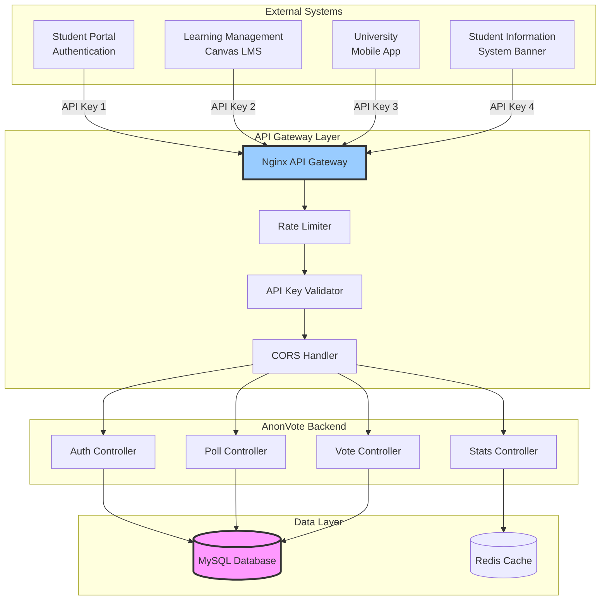
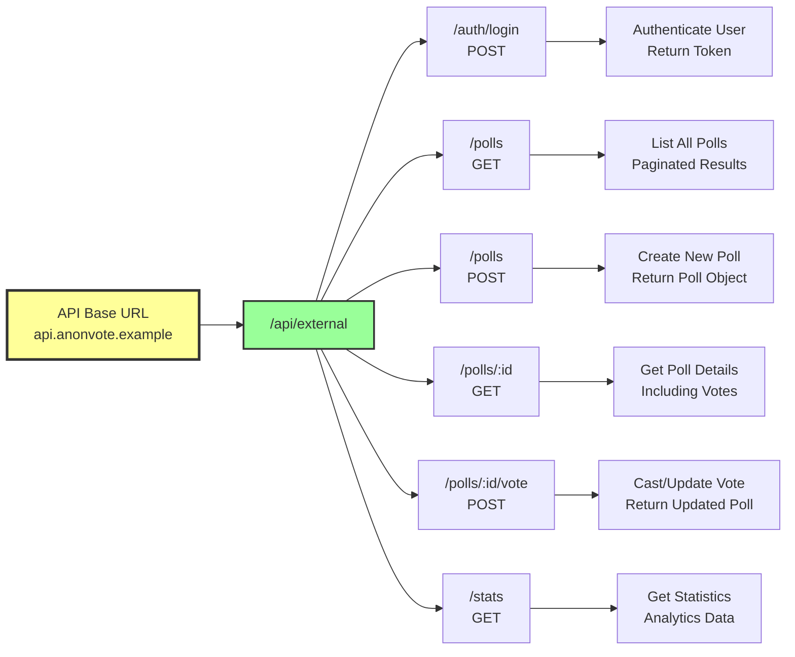
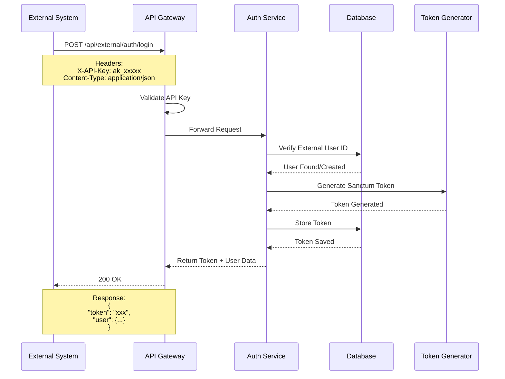
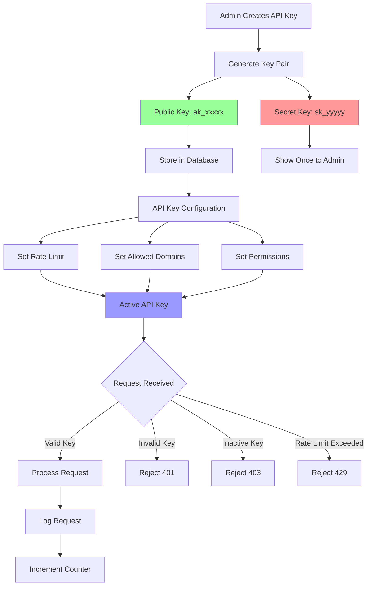
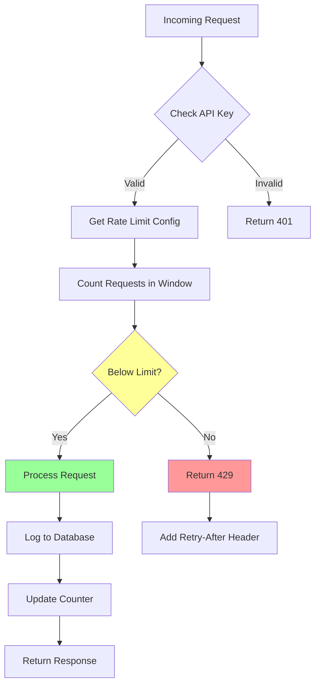
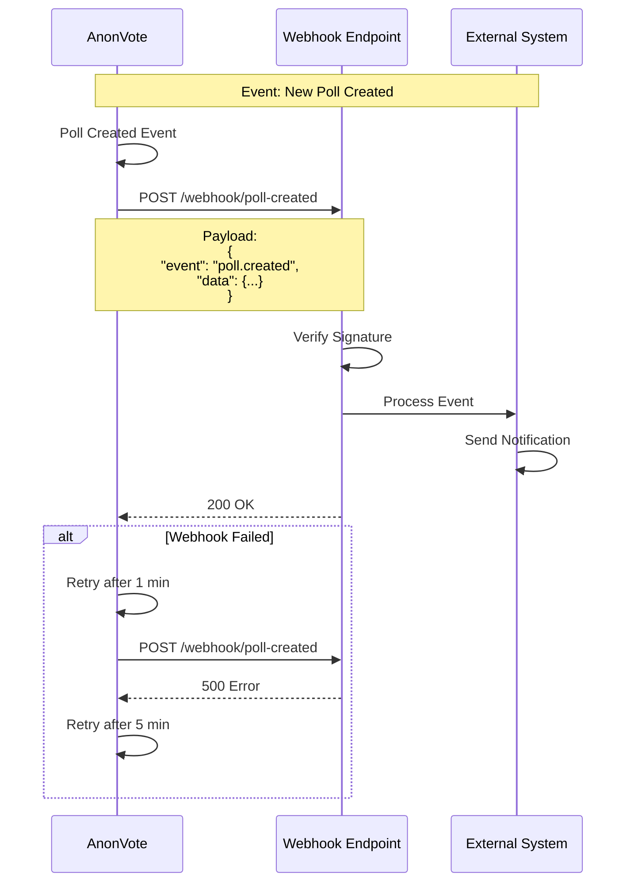
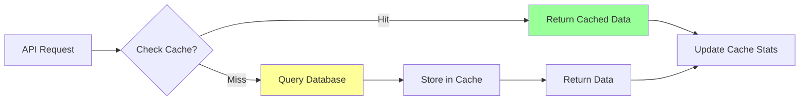
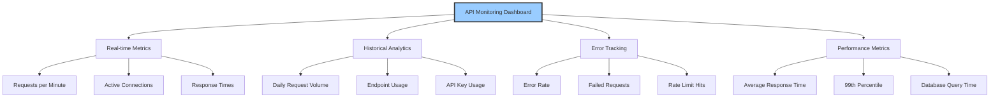

# 🔌 API Integration Architecture

## Overview

The AnonVote API Integration Architecture enables seamless integration with external university systems, mobile applications, and third-party platforms through a secure, scalable API gateway.

---

## System Integration Diagram



---

## API Endpoints Structure



---

## Authentication Flow



---

## Request/Response Examples

### 1. Authentication

**Request:**
```http
POST /api/external/auth/login HTTP/1.1
Host: api.anonvote.edu
X-API-Key: ak_1234567890abcdef
Content-Type: application/json

{
  "external_user_id": "STU-2024-12345",
  "display_name": "Anonymous Student",
  "real_identity": "john.doe@university.edu"
}
```

**Response:**
```json
{
  "success": true,
  "token": "1|abcdefghijklmnopqrstuvwxyz1234567890",
  "user": {
    "id": 123,
    "display_name": "Anonymous Student",
    "external_user_id": "STU-2024-12345"
  }
}
```

---

### 2. List Polls

**Request:**
```http
GET /api/external/polls?page=1&per_page=10 HTTP/1.1
Host: api.anonvote.edu
X-API-Key: ak_1234567890abcdef
Authorization: Bearer 1|abcdefghijklmnopqrstuvwxyz1234567890
```

**Response:**
```json
{
  "success": true,
  "polls": [
    {
      "id": 1,
      "title": "Should we extend library hours?",
      "description": "Vote on whether the library should stay open until midnight",
      "vote_type": "both",
      "upvotes_count": 145,
      "downvotes_count": 23,
      "total_voters": 168,
      "user_vote": null,
      "creator": {
        "id": 5,
        "display_name": "Student Council"
      },
      "created_at": "2024-12-01T10:00:00Z",
      "expires_at": "2024-12-31T23:59:59Z"
    }
  ],
  "pagination": {
    "current_page": 1,
    "per_page": 10,
    "total": 45,
    "last_page": 5
  }
}
```

---

### 3. Create Poll

**Request:**
```http
POST /api/external/polls HTTP/1.1
Host: api.anonvote.edu
X-API-Key: ak_1234567890abcdef
Authorization: Bearer 1|abcdefghijklmnopqrstuvwxyz1234567890
Content-Type: application/json

{
  "title": "New Campus Gym Equipment",
  "description": "Should we purchase new cardio machines?",
  "vote_type": "both",
  "expires_at": "2024-12-31T23:59:59Z"
}
```

**Response:**
```json
{
  "success": true,
  "message": "Poll created successfully",
  "poll": {
    "id": 46,
    "title": "New Campus Gym Equipment",
    "description": "Should we purchase new cardio machines?",
    "vote_type": "both",
    "upvotes_count": 0,
    "downvotes_count": 0,
    "total_voters": 0,
    "is_active": true,
    "created_at": "2024-12-08T14:30:00Z"
  }
}
```

---

### 4. Cast Vote

**Request:**
```http
POST /api/external/polls/1/vote HTTP/1.1
Host: api.anonvote.edu
X-API-Key: ak_1234567890abcdef
Authorization: Bearer 1|abcdefghijklmnopqrstuvwxyz1234567890
Content-Type: application/json

{
  "vote_type": "up"
}
```

**Response:**
```json
{
  "success": true,
  "message": "Vote recorded successfully",
  "poll": {
    "id": 1,
    "title": "Should we extend library hours?",
    "upvotes_count": 146,
    "downvotes_count": 23,
    "total_voters": 169,
    "user_vote": "up"
  }
}
```

---

### 5. Get Statistics

**Request:**
```http
GET /api/external/stats HTTP/1.1
Host: api.anonvote.edu
X-API-Key: ak_1234567890abcdef
Authorization: Bearer 1|abcdefghijklmnopqrstuvwxyz1234567890
```

**Response:**
```json
{
  "success": true,
  "stats": {
    "total_polls": 45,
    "active_polls": 23,
    "total_votes": 5678,
    "total_users": 1234,
    "polls_today": 3,
    "votes_today": 234
  }
}
```

---

## API Key Management



---

## Rate Limiting Strategy

### Rate Limit Tiers

| Tier | Rate Limit | Use Case | Monthly Cost |
|------|------------|----------|--------------|
| **Free** | 1,000/hour | Testing, Small Apps | $0 |
| **Standard** | 5,000/hour | Mobile Apps | $49 |
| **Premium** | 10,000/hour | Large Deployments | $149 |
| **Enterprise** | Unlimited | University-wide | Custom |

### Rate Limit Headers

Every API response includes rate limit information:

```http
HTTP/1.1 200 OK
X-RateLimit-Limit: 5000
X-RateLimit-Remaining: 4873
X-RateLimit-Reset: 1702054800
```

### Rate Limit Algorithm



**Rate Limit Calculation:**
```
requests_in_last_hour = COUNT(api_logs 
  WHERE api_key_id = X 
  AND created_at >= NOW() - INTERVAL 1 HOUR)

if requests_in_last_hour >= rate_limit:
  return 429 Rate Limit Exceeded
else:
  process request
```

---

## Integration Examples

### JavaScript/Node.js Integration

```javascript
// AnonVote JavaScript SDK
class AnonVoteClient {
  constructor(apiKey, baseUrl = 'https://api.anonvote.edu') {
    this.apiKey = apiKey;
    this.baseUrl = baseUrl;
    this.token = null;
  }

  async authenticate(externalUserId, displayName, realIdentity) {
    const response = await fetch(`${this.baseUrl}/api/external/auth/login`, {
      method: 'POST',
      headers: {
        'X-API-Key': this.apiKey,
        'Content-Type': 'application/json',
      },
      body: JSON.stringify({
        external_user_id: externalUserId,
        display_name: displayName,
        real_identity: realIdentity,
      }),
    });

    const data = await response.json();
    this.token = data.token;
    return data;
  }

  async getPolls(page = 1, perPage = 10) {
    const response = await fetch(
      `${this.baseUrl}/api/external/polls?page=${page}&per_page=${perPage}`,
      {
        headers: {
          'X-API-Key': this.apiKey,
          'Authorization': `Bearer ${this.token}`,
        },
      }
    );

    return await response.json();
  }

  async vote(pollId, voteType) {
    const response = await fetch(
      `${this.baseUrl}/api/external/polls/${pollId}/vote`,
      {
        method: 'POST',
        headers: {
          'X-API-Key': this.apiKey,
          'Authorization': `Bearer ${this.token}`,
          'Content-Type': 'application/json',
        },
        body: JSON.stringify({ vote_type: voteType }),
      }
    );

    return await response.json();
  }
}

// Usage
const client = new AnonVoteClient('ak_your_api_key_here');

// Authenticate
await client.authenticate('STU-2024-001', 'John Doe', 'john@university.edu');

// Get polls
const polls = await client.getPolls();

// Vote
await client.vote(1, 'up');
```

---

### Python Integration

```python
import requests
from typing import Optional

class AnonVoteClient:
    def __init__(self, api_key: str, base_url: str = "https://api.anonvote.edu"):
        self.api_key = api_key
        self.base_url = base_url
        self.token: Optional[str] = None
    
    def authenticate(self, external_user_id: str, display_name: str, real_identity: str):
        """Authenticate user and get token"""
        response = requests.post(
            f"{self.base_url}/api/external/auth/login",
            headers={
                "X-API-Key": self.api_key,
                "Content-Type": "application/json"
            },
            json={
                "external_user_id": external_user_id,
                "display_name": display_name,
                "real_identity": real_identity
            }
        )
        data = response.json()
        self.token = data["token"]
        return data
    
    def get_polls(self, page: int = 1, per_page: int = 10):
        """Get list of polls"""
        response = requests.get(
            f"{self.base_url}/api/external/polls",
            headers={
                "X-API-Key": self.api_key,
                "Authorization": f"Bearer {self.token}"
            },
            params={"page": page, "per_page": per_page}
        )
        return response.json()
    
    def vote(self, poll_id: int, vote_type: str):
        """Cast a vote on a poll"""
        response = requests.post(
            f"{self.base_url}/api/external/polls/{poll_id}/vote",
            headers={
                "X-API-Key": self.api_key,
                "Authorization": f"Bearer {self.token}",
                "Content-Type": "application/json"
            },
            json={"vote_type": vote_type}
        )
        return response.json()

# Usage
client = AnonVoteClient("ak_your_api_key_here")

# Authenticate
client.authenticate("STU-2024-001", "John Doe", "john@university.edu")

# Get polls
polls = client.get_polls()

# Vote
result = client.vote(1, "up")
```

---

### PHP Integration

```php
<?php

class AnonVoteClient {
    private $apiKey;
    private $baseUrl;
    private $token;

    public function __construct($apiKey, $baseUrl = 'https://api.anonvote.edu') {
        $this->apiKey = $apiKey;
        $this->baseUrl = $baseUrl;
    }

    public function authenticate($externalUserId, $displayName, $realIdentity) {
        $response = $this->makeRequest('POST', '/api/external/auth/login', [
            'external_user_id' => $externalUserId,
            'display_name' => $displayName,
            'real_identity' => $realIdentity,
        ]);

        $this->token = $response['token'];
        return $response;
    }

    public function getPolls($page = 1, $perPage = 10) {
        return $this->makeRequest('GET', "/api/external/polls?page={$page}&per_page={$perPage}");
    }

    public function vote($pollId, $voteType) {
        return $this->makeRequest('POST', "/api/external/polls/{$pollId}/vote", [
            'vote_type' => $voteType,
        ]);
    }

    private function makeRequest($method, $endpoint, $data = null) {
        $headers = [
            'X-API-Key: ' . $this->apiKey,
            'Content-Type: application/json',
        ];

        if ($this->token) {
            $headers[] = 'Authorization: Bearer ' . $this->token;
        }

        $ch = curl_init($this->baseUrl . $endpoint);
        curl_setopt($ch, CURLOPT_HTTPHEADER, $headers);
        curl_setopt($ch, CURLOPT_RETURNTRANSFER, true);

        if ($method === 'POST') {
            curl_setopt($ch, CURLOPT_POST, true);
            curl_setopt($ch, CURLOPT_POSTFIELDS, json_encode($data));
        }

        $response = curl_exec($ch);
        curl_close($ch);

        return json_decode($response, true);
    }
}

// Usage
$client = new AnonVoteClient('ak_your_api_key_here');

// Authenticate
$client->authenticate('STU-2024-001', 'John Doe', 'john@university.edu');

// Get polls
$polls = $client->getPolls();

// Vote
$result = $client->vote(1, 'up');
```

---

## Webhook Integration



### Webhook Events

| Event | Description | Payload |
|-------|-------------|---------|
| `poll.created` | New poll created | Poll object |
| `poll.updated` | Poll modified | Updated poll |
| `poll.deleted` | Poll removed | Poll ID |
| `vote.cast` | User voted | Poll ID, Vote count |
| `user.banned` | User banned | User ID, Reason |

### Webhook Signature Verification

```javascript
const crypto = require('crypto');

function verifyWebhookSignature(payload, signature, secret) {
  const hash = crypto
    .createHmac('sha256', secret)
    .update(JSON.stringify(payload))
    .digest('hex');
    
  return hash === signature;
}

// Express.js example
app.post('/webhook/anonvote', (req, res) => {
  const signature = req.headers['x-anonvote-signature'];
  const isValid = verifyWebhookSignature(
    req.body,
    signature,
    process.env.WEBHOOK_SECRET
  );
  
  if (!isValid) {
    return res.status(401).json({ error: 'Invalid signature' });
  }
  
  // Process webhook
  console.log('Event:', req.body.event);
  console.log('Data:', req.body.data);
  
  res.status(200).json({ received: true });
});
```

---

## Error Handling

### Error Response Format

```json
{
  "success": false,
  "error": {
    "code": "RATE_LIMIT_EXCEEDED",
    "message": "You have exceeded your rate limit of 5000 requests per hour",
    "details": {
      "limit": 5000,
      "remaining": 0,
      "reset_at": "2024-12-08T15:00:00Z"
    }
  }
}
```

### Common Error Codes

| HTTP Status | Error Code | Description |
|-------------|------------|-------------|
| 400 | `BAD_REQUEST` | Invalid request parameters |
| 401 | `UNAUTHORIZED` | Missing or invalid API key |
| 403 | `FORBIDDEN` | API key inactive or insufficient permissions |
| 404 | `NOT_FOUND` | Resource not found |
| 429 | `RATE_LIMIT_EXCEEDED` | Too many requests |
| 500 | `INTERNAL_ERROR` | Server error |
| 503 | `SERVICE_UNAVAILABLE` | Maintenance mode |

---

## Security Best Practices

### 1. API Key Security

✅ **DO:**
- Store API keys in environment variables
- Rotate keys regularly (every 90 days)
- Use different keys for development and production
- Implement key rotation without downtime

❌ **DON'T:**
- Hardcode API keys in source code
- Commit keys to version control
- Share keys publicly
- Use same key across multiple apps

### 2. Request Signing

For high-security integrations, implement request signing:

```javascript
const crypto = require('crypto');

function signRequest(payload, secret) {
  const timestamp = Date.now();
  const message = timestamp + JSON.stringify(payload);
  const signature = crypto
    .createHmac('sha256', secret)
    .update(message)
    .digest('hex');
    
  return {
    timestamp,
    signature
  };
}

// Usage
const { timestamp, signature } = signRequest(payload, apiSecret);

fetch('https://api.anonvote.edu/api/external/polls', {
  method: 'POST',
  headers: {
    'X-API-Key': apiKey,
    'X-Timestamp': timestamp,
    'X-Signature': signature,
    'Content-Type': 'application/json'
  },
  body: JSON.stringify(payload)
});
```

### 3. IP Whitelisting

Configure allowed IP addresses for API keys:

```json
{
  "api_key": "ak_1234567890",
  "allowed_ips": [
    "192.168.1.100",
    "10.0.0.0/24",
    "203.0.113.0/24"
  ]
}
```

---

## Performance Optimization

### Caching Strategy



**Cacheable Endpoints:**
- `GET /api/external/polls` - Cache for 60 seconds
- `GET /api/external/polls/:id` - Cache for 30 seconds
- `GET /api/external/stats` - Cache for 300 seconds

**Cache Headers:**
```http
Cache-Control: public, max-age=60
ETag: "686897696a7c876b7e"
Last-Modified: Mon, 08 Dec 2024 14:30:00 GMT
```

---

## Monitoring & Analytics

### API Usage Dashboard



### Metrics Tracked

| Metric | Description | Alert Threshold |
|--------|-------------|-----------------|
| Request Rate | Requests per minute | > 10,000/min |
| Error Rate | Failed requests % | > 1% |
| Response Time | Average latency | > 500ms |
| Cache Hit Rate | Cache effectiveness | < 80% |
| API Key Usage | Per-key request count | 90% of limit |

---

## Support & Resources

### Documentation
<!-- - 📘 [API Reference](https://docs.anonvote.edu/api) 
- 🚀 [Quick Start Guide](https://docs.anonvote.edu/quickstart) -->
- 💡 [Integration Examples](https://github.com/anonvote/examples)

<!--
### Community
- 💬 [Developer Forum](https://forum.anonvote.edu)
- 🐛 [Issue Tracker](https://github.com/anonvote/api/issues)
- 📧 [Email Support](mailto:api-support@anonvote.edu)

### SLA Guarantees
- ✅ 99.9% uptime
- ✅ < 200ms average response time
- ✅ 24/7 support for Enterprise tier
- ✅ 99.99% data durability

---

**Last Updated:** December 8, 2025
**API Version:** v1.0  
**Documentation Version:** 1.0
